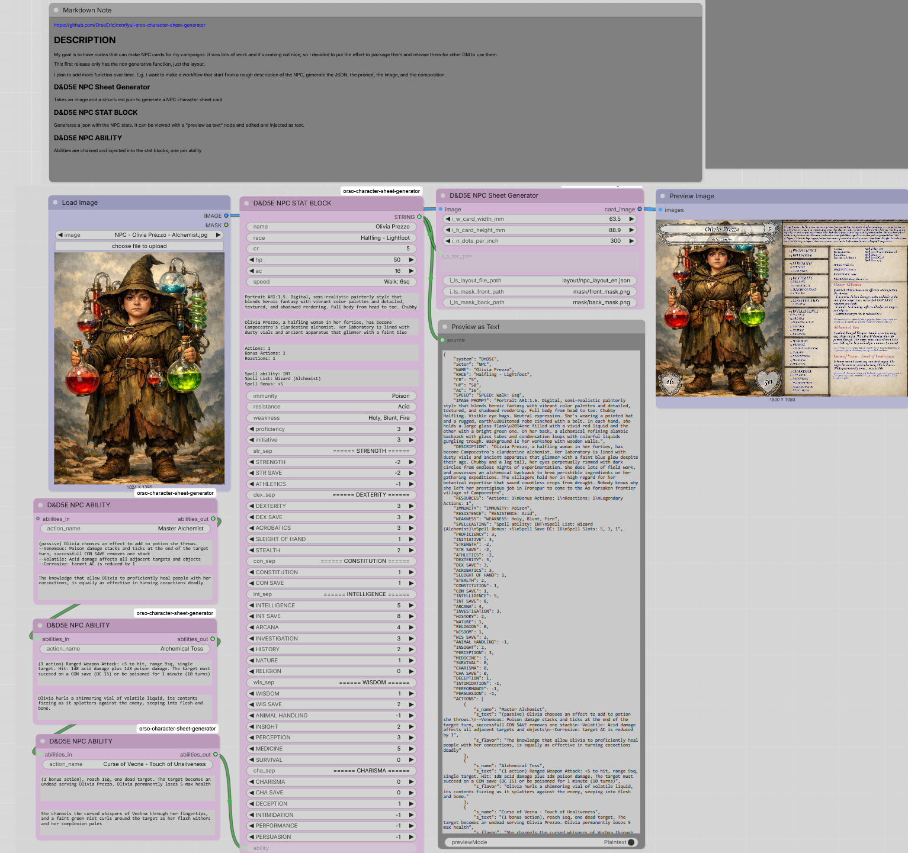

# ComfyUI

The scope of this repository is to document how to run Comfy UI with ROCm acceleration with a AMD 7900XTX under Windows.

## Value Proposition

Nvidia and CUDA works better. But Nvidia makes you pay a significant premium for VRAM, and VRAM is critical to machine learning.

When choosing how to upgrade in 2025-01 my choices were
- AMD 7900XTX 24GB: 940€
- Nvidia 3090 24GB 4 years old used: 750€
- Nvidia 4090 24GB: 2500 €
- Nvidia 5090 32GB: 3500 €

In my region the 7900XTX still goes for 850€ to 950€ at the time of update 2025-12-09, and in my opinion this is amazing value to accelerate ComfyUI generation and local LLMs.

16GB cards are more affordable, but those 8GB extra go a long way in inference.

## Hardware 

- AMD RX 7900 XTX 24GB <--- The GOAT
- Intel 13700F
- DDR5 4x16GB 64GB 6400 CL32

## ComfyUI vs AMD ROCm

The achille's heel of AMD card, is the stack. It's bad. As of 2026-01-25 ROCm has windows binaries for pytorch that works to an extent with decent performance with ComfyUI.

[Now it works with the default driver 26.1.1](https://www.amd.com/en/resources/support-articles/release-notes/RN-RAD-WIN-26-1-1.html) Make sure you install Pytorch option in the AI tab of adrenaline.

[ComfyUI has a portable release ROCm 7.1](https://github.com/Comfy-Org/ComfyUI/releases/tag/v0.10.0).

[Building it pip works better for me, as I can build with ROCm 7.2](/install-comfyui-adrenaline26_1_1-rocm7_2-p3_12.bat.bat). Read the script and what it does.

## EXTERNAL MODEL FOLDER

The environment can brick easily. 

It is convenient to move the models outside the ComfyUI folder, so that when I rebuild, the models are all there. This also allows multiple local env to all access models without duplication.


```extra_model_paths.yaml```

```yaml
comfyui:
    # Go up to the parent folder, and look for the model folder there
    base_path: ..\ComfyUI-Models
    # Model Folder
    checkpoints: checkpoints\
    clip: clip\
    clip_vision: clip_vision\
    text_encoders: text_encoders\
    configs: configs\
    controlnet: controlnet\
    diffusion_models: |
                diffusion_models
                unet
    embeddings: embeddings\
    loras: loras\
    upscale_models: upscale_models\
    vae: vae\
    # custom vibevoice node dumps here
    vibevoice: vibevoice\
```

# INSTALLATION

AMD Driver, 

Documentation listing [ROCm Version History](https://rocm.docs.amd.com/en/latest/release/versions.html) for each version


[ROCm Wheels 7.2.1 P3.12](https://repo.radeon.com/rocm/windows/rocm-rel-7.2.1/)

### PREVIEW

[Preview ROCm Wheels](https://rocm.nightlies.amd.com/v2)

As of 2026-04-06 Preview wheels use ROCm 7.10


## RUN

uv run main.py 

# PORTABLE 

It's very convenient, but it works somewhat different

### ComfyUI manager

```cmd

```

## LAUNCH ARGUMENTS

ROCm cannot handle memory properly, there need to be mitigations [2026-07-26 testing](/logs/2026-07-26b-dynamic-memory-flag.md)


### FLAGS

```--windows-standalone-build``` core flag to make ROCm work

```--disable-api-nodes``` remove the useless node that need cloud APIs to work

```--enable-dynamic-vram``` weird interaction with ROCm, on big models cause timeouts

```--enable-manager``` core flag to enable the manager. can omit it to load somewhat faster

```--use-pytorch-cross-attention``` ??? I think it's not needed as it's already inside

```--disable-smart-memory``` Important


## Launch without Manager

Remove API nodes, but disables the manager

Uses ROCm workaround that prevent driver crashes

```cmd
set COMFYUI_ENABLE_MIOPEN=1
set MIOPEN_FIND_MODE=2
.\python_embeded\python.exe -s ComfyUI\main.py --windows-standalone-build --disable-smart-memory --disable-api-nodes
```

## Launch with Manager

The Manager needs the API to run

Uses ROCm workaround that prevent driver crashes

```cmd
set COMFYUI_ENABLE_MIOPEN=1
set MIOPEN_FIND_MODE=2
.\python_embeded\python.exe -s ComfyUI\main.py --windows-standalone-build --disable-smart-memory --enable-manager
```

# WORKFLOWS

## Test VAE Decode


## Zimage 

Strong fast model, it works amazingly well

| MODEL | CLIP | VAE | First Load [s] | Second Repeat [s] | Third Change Prompt [s] |
|-|-|-|-|-|-|
| Q4 GGUF | Q4 GGUF | SAFETENSOR | 30s | 16s | 18s |
| INT8 CONVROT SAFETENSOR | INT8 CONVROT SAFETENSOR | SAFETENSOR | N.A. | N.A. | N.A. |


GGUF


SAFETENSOR INT8 CONVROT


<details>
<summary>Performance</summary>

```cmd
got prompt
Using split attention in VAE
Using split attention in VAE
VAE load device: cuda:0, offload device: cpu, dtype: torch.bfloat16
CLIP/text encoder model load device: cuda:0, offload device: cpu, current: cpu, dtype: torch.float16
Requested to load ZImageTEModel_
loaded completely; 22392.36 MB usable, 7672.25 MB loaded, full load: True
gguf qtypes: F32 (245), F16 (24), Q4_K (120), Q6_K (30), BF16 (4), Q5_K (30)
model weight dtype torch.bfloat16, manual cast: None
model_type FLOW
Requested to load Lumina2
loaded completely; 22296.06 MB usable, 4834.06 MB loaded, full load: True
100%|███████████████████████████████████████████████████████████████████████████████████████████| 9/9 [00:12<00:00,  1.39s/it]
Requested to load AutoencodingEngine
loaded completely; 11319.68 MB usable, 159.87 MB loaded, full load: True
Prompt executed in 28.92 seconds
got prompt
Requested to load ZImageTEModel_
loaded completely; 22392.36 MB usable, 7672.25 MB loaded, full load: True
Requested to load Lumina2
loaded completely; 22296.06 MB usable, 4834.06 MB loaded, full load: True
100%|███████████████████████████████████████████████████████████████████████████████████████████| 9/9 [00:12<00:00,  1.40s/it]
Requested to load AutoencodingEngine
loaded completely; 11319.68 MB usable, 159.87 MB loaded, full load: True
Prompt executed in 19.32 seconds
got prompt
Requested to load Lumina2
loaded completely; 22296.06 MB usable, 4834.06 MB loaded, full load: True
100%|███████████████████████████████████████████████████████████████████████████████████████████| 9/9 [00:12<00:00,  1.41s/it]
Requested to load AutoencodingEngine
loaded completely; 11319.68 MB usable, 159.87 MB loaded, full load: True
Prompt executed in 15.71 seconds
got prompt
Requested to load ZImageTEModel_
loaded completely; 22392.36 MB usable, 7672.25 MB loaded, full load: True
Requested to load Lumina2
loaded completely; 22296.06 MB usable, 4834.06 MB loaded, full load: True
100%|███████████████████████████████████████████████████████████████████████████████████████████| 9/9 [00:12<00:00,  1.40s/it]
Requested to load AutoencodingEngine
loaded completely; 11319.68 MB usable, 159.87 MB loaded, full load: True
Prompt executed in 19.17 seconds
```

</details>

## Qwen Edit

Strong model that is very good at executing edit instructions and taking multiple reference images.


```uv run main.py --windows-standalone-build --disable-smart-memory```
- First execution: 60s
- Repeat: 46s

<details>
<summary>Performance</summary>

```cmd
got prompt
Using split attention in VAE
Using split attention in VAE
VAE load device: cuda:0, offload device: cpu, dtype: torch.bfloat16
gguf qtypes: Q8_0 (198), F32 (141)
Dequantizing token_embd.weight to prevent runtime OOM.
Attenpting to find mmproj file for text encoder...
Using mmproj 'qwen2.5-vl-7b-instruct-q8_0-mmproj-fp16.gguf' for text encoder 'qwen2.5-vl-7b-instruct-q8_0.gguf'.
gguf qtypes: F32 (291), F16 (228)
CLIP/text encoder model load device: cuda:0, offload device: cpu, current: cpu, dtype: torch.float16
Requested to load WanVAE
loaded completely; 20161.56 MB usable, 242.03 MB loaded, full load: True
Requested to load QwenImageTEModel_
loaded completely; 22392.36 MB usable, 8946.75 MB loaded, full load: True
gguf qtypes: F32 (1088), BF16 (6), Q6_K (258), Q8_0 (2), Q5_K (20), Q4_K (560)
model weight dtype torch.bfloat16, manual cast: None
model_type FLUX
Requested to load QwenImage
loaded completely; 22033.91 MB usable, 12738.98 MB loaded, full load: True
100%|███████████████████████████████████████████████████████████████████████████████████████████| 4/4 [00:25<00:00,  6.31s/it]
Requested to load WanVAE
loaded completely; 18811.56 MB usable, 242.03 MB loaded, full load: True
Prompt executed in 58.36 seconds
got prompt
Requested to load QwenImage
loaded completely; 22033.91 MB usable, 12738.98 MB loaded, full load: True
100%|███████████████████████████████████████████████████████████████████████████████████████████| 4/4 [00:24<00:00,  6.24s/it]
Requested to load WanVAE
loaded completely; 18811.56 MB usable, 242.03 MB loaded, full load: True
Prompt executed in 45.39 seconds
got prompt
Requested to load QwenImage
loaded completely; 22033.91 MB usable, 12738.98 MB loaded, full load: True
100%|███████████████████████████████████████████████████████████████████████████████████████████| 4/4 [00:25<00:00,  6.29s/it]
Requested to load WanVAE
loaded completely; 18811.56 MB usable, 242.03 MB loaded, full load: True
Prompt executed in 43.96 seconds
got prompt
Requested to load QwenImage
loaded completely; 22033.91 MB usable, 12738.98 MB loaded, full load: True
100%|███████████████████████████████████████████████████████████████████████████████████████████| 4/4 [00:25<00:00,  6.29s/it]
Requested to load WanVAE
loaded completely; 18811.56 MB usable, 242.03 MB loaded, full load: True
Prompt executed in 44.29 seconds
```

</details>

```uv run main.py --windows-standalone-build --use-pytorch-cross-attention```
- First execution: 98s
- Repeat: 32s

<details>
<summary>Performance</summary>

```cmd
got prompt
100%|███████████████████████████████████████████████████████████████████████████████████████████| 4/4 [00:35<00:00,  8.79s/it]
Requested to load WanVAE
0 models unloaded.
loaded partially; 0.00 MB usable, 0.00 MB loaded, 242.00 MB offloaded, 22.78 MB buffer reserved, lowvram patches: 0
Prompt executed in 98.22 seconds
Requested to load QwenImage
0 models unloaded.
loaded partially; 0.00 MB usable, 0.00 MB loaded, 12738.98 MB offloaded, 224.60 MB buffer reserved, lowvram patches: 0
100%|███████████████████████████████████████████████████████████████████████████████████████████| 4/4 [00:31<00:00,  7.82s/it]
Requested to load WanVAE
0 models unloaded.
loaded partially; 0.00 MB usable, 0.00 MB loaded, 242.00 MB offloaded, 22.78 MB buffer reserved, lowvram patches: 0
Prompt executed in 31.98 seconds
Requested to load QwenImage
0 models unloaded.
loaded partially; 0.00 MB usable, 0.00 MB loaded, 12738.98 MB offloaded, 224.60 MB buffer reserved, lowvram patches: 0
100%|███████████████████████████████████████████████████████████████████████████████████████████| 4/4 [00:31<00:00,  7.80s/it]
Requested to load WanVAE
0 models unloaded.
loaded partially; 0.00 MB usable, 0.00 MB loaded, 242.00 MB offloaded, 22.78 MB buffer reserved, lowvram patches: 0
Prompt executed in 31.91 seconds
Requested to load QwenImage
0 models unloaded.
loaded partially; 0.00 MB usable, 0.00 MB loaded, 12738.98 MB offloaded, 224.60 MB buffer reserved, lowvram patches: 0
100%|███████████████████████████████████████████████████████████████████████████████████████████| 4/4 [00:31<00:00,  7.84s/it]
Requested to load WanVAE
0 models unloaded.
loaded partially; 0.00 MB usable, 0.00 MB loaded, 242.00 MB offloaded, 22.78 MB buffer reserved, lowvram patches: 0
Prompt executed in 32.06 seconds
Requested to load QwenImage
0 models unloaded.
loaded partially; 0.00 MB usable, 0.00 MB loaded, 12738.98 MB offloaded, 224.60 MB buffer reserved, lowvram patches: 0
100%|███████████████████████████████████████████████████████████████████████████████████████████| 4/4 [00:31<00:00,  7.83s/it]
Requested to load WanVAE
0 models unloaded.
loaded partially; 0.00 MB usable, 0.00 MB loaded, 242.00 MB offloaded, 22.78 MB buffer reserved, lowvram patches: 0
Prompt executed in 32.02 seconds
```

</details>

## Krea 2

| NOTE | First Run [s] | Second Run [s] | Third Run with prompt change [s] | VRAM | Driver Crash? |
|-|-|-|-|-|-|
| --enable-dynamic-vram | 30.82 | 27.57 | fail | 24GB+ | 3° run |
|  | 34.27 | fail | fail | 24GB+ | 2° run |
|  --disable-smart-memory  | 83.60 | 43.33| 38.54 | 18.9GB | no crash |
| MIOPEN_FIND_MODE=2 --disable-smart-memory  | 38.61 | 28.37 | 30.73 | 18.9GB |  no crash |
| MIOPEN_FIND_MODE=2 --disable-smart-memory --use-pytorch-cross-attention | 47.31 | 28.19  | 31.04 | 20.4GB |  no crash |


| MODEL | CLIP | VAE | First Load [s] | Second Repeat [s] | Third Change Prompt [s] | NOTE |
|-|-|-|-|-|-|-|
| FP8 SAFETENSOR | FP8 SAFETENSOR | SAFETENSOR | 39.96 | 28.37 | 29.84 | |
| Q4 GGUF | FP8 SAFETENSOR | SAFETENSOR | 35.19s | 30.38 | 32.75 | |
| Q4 GGUF | FP8 SAFETENSOR | SAFETENSOR | N.A. | N.A. | N.A. | mismatch dimensions? |

#### GGUF


#### FP8 SAFETENSOR


#### INT8 CONVROT

Right now (2026-08-01) doesn't work under windows ROCm it crashes the runtime


### IMAGE CLIP

Qwen3VL is mighty and can accept image input. So you can feed image as prompt, this without filling  latent VAE encode and encodes structural informations about the image.

This isn't IMG2IMG is still TXT2IMG bur the coordinates of the image are the latents decoded by the VL model.


## Hunyuan 3D 2.0 MV

This workflow uses A background removal model, followed by Qwen Edit Q4 to generate the back, followed by Hunyuan 2.0 multiview to generate the 3D model


[Logs](/logs/2026-01-25-T1300-Hunyuan3D%2020.log)


## PROMPT GENERATION

The text encoder is Qwen 3 VL, with a prompt you can reliably make json prompts

#### IMAGE => PROMPT


#### PROMPT => IMAGE


System prompt to create json prompt, it supports image inputs

<details>
<summary>SYSTEM PROMPT</summary>

```txt
You are an expert JSON image prompt architect. Your task is to convert any natural language description into a highly structured, valid JSON-formatted image generation prompt. Target 20 to 30 json entries.

OUTPUT SCHEMA:
Return only a single valid JSON object following this exact structure. Omit any top-level keys that are not relevant to the input. Infer logical cinematic defaults for missing details. Use snake_case for all keys to ensure JSON validity.
{
  "aesthetics": {
    "color_palette": "String describing dominant and accent colors",
    "textures": "String describing surface materials and tactile qualities",
    "atmosphere": "String describing environmental mood and ambient effects",
    "lighting": "String describing light source, direction, and quality"
  },
  "background": {
    "environment": "String describing primary setting",
    "elements": "String describing secondary background details with spatial positioning",
    "depth": "String describing foreground/midground/background layering"
  },
  "composition": {
    "shot_type": "String describing camera angle and framing",
    "focus": "String describing primary visual anchor",
    "spatial_layout": "String describing relative positioning of key elements"
  },
  "style": {
    "art_direction": "String describing genre and artistic movement",
    "rendering": "String describing technique and visual fidelity",
    "mood": "String describing emotional tone and pacing"
  },
  "<descriptive_subject_key>": {
    "identity": "String combining race, gender, and class (e.g., female elf warrior)",
    "age": "String",
    "expression": {
      "eyes": "String",
      "mouth": "String",
      "energy": "String"
    },
    "face": "String",
    "hair": "String",
    "body": "String",
    "eyes": "String",
    "clothing": "String",
    "patterns": "String",
    "tattoos": "String",
    "pose": "String",
    "location": "String describing dimension and position relative to frame",
    "equipment": {
      "armor": "String describing protective gear and material finish",
      "gear": "String describing utility items and functional tools",
      "accessories": "String describing decorative or symbolic trinkets",
      "tools": "String describing handheld or mounted equipment"
    }
  }
  "<descriptive_weapon_key>": {
    "identity": "String describing weapon type (e.g., two handed scythe)",
    "description": "String detailing form, size, and visual design",
    "material": "String describing construction and surface finish",
    "condition": "String describing wear, damage, or polish",
    "visual_effects": "String describing glow, particles, or magical/tech properties",
    "owner": "<descriptive_subject_key>"
  }

}

RULES:
DO:
- Output strictly valid JSON. No markdown formatting, no explanations, no extra text.
- Use descriptive snake_case or camelCase keys for subjects and weapons based on race, gender, class, and item type (e.g., "female_elf_warrior", "two_handed_scythe").
- Include an "equipment" dictionary inside every subject with precise sub-fields.
- Infer logical cinematic defaults (lens type, camera behavior, lighting quality, texture resolution) when not specified.
- Use only precise, positive qualifiers. No negative prompts, no vague terms, no "none" or "null" values.
- Keep descriptions lean, targeted, and optimized for AI image generation pipelines.
- If there is text to be rendered put it in brackets >TEXT TO BE RENDERED< with font descrtiption texture position

DO NOT:
- Force irrelevant fields or pad the JSON to reach an arbitrary field count.
- Use inconsistent casing, malformed syntax, or unescaped quotes.
- Include empty objects, null values, or placeholder text.
- Use generic descriptors like "mark on wrist". Be specific: "crimson serpent tattoo coiling around left forearm".
- Use JSON arrays for lists. Convert all lists into descriptive strings.

EXAMPLE:
{
  "aesthetics": {
    "color_palette": "Dark browns, golds, and warm amber tones with subtle highlights",
    "textures": "Fur, leather, metal, and stone surfaces with tactile realism",
    "atmosphere": "Intimate, scholarly, and slightly mysterious with candlelight ambiance",
    "lighting": "Soft directional candlelight from right, creating chiaroscuro highlights on fur and trophy"
  },
  "background": {
    "environment": "Dimly lit medieval library or study with wooden shelves",
    "elements": "Bookshelves filled with aged tomes, a single lit candle in a brass holder to the right",
    "depth": "Foreground: otter subject; midground: bookshelves; background: blurred stone wall and candle glow"
  },
  "composition": {
    "shot_type": "Medium close-up portrait shot with shallow depth of field",
    "focus": "Otter’s face and trophy, sharply detailed against softly blurred background",
    "spatial_layout": "Otter centered, holding trophy in left paw, adjusting spectacles with right paw"
  },
  "style": {
    "art_direction": "Cinematic fantasy realism with high-detail character design",
    "rendering": "High-resolution photorealistic rendering with micro-texture fidelity",
    "mood": "Confident, proud, and intellectual with a touch of whimsical gravitas"
  },
  "Male Otter Professor": {
    "age": "Adult",
    "expression": {
      "eyes": "Sharp, focused, slightly narrowed with intellectual intensity",
      "mouth": "Closed, neutral expression with slight smirk",
      "energy": "Calm, self-assured, and contemplative"
    },
    "face": "Detailed facial features with whiskers, dark eyes, and soft muzzle",
    "hair": "Short, dense, dark brown fur with lighter undercoat",
    "body": "Compact, sturdy build with thick fur and dexterous paws",
    "eyes": "Large, dark, intelligent eyes with reflective sheen",
    "clothing": "Worn leather tunic over dark woolen cloak with visible stitching and frayed edges",
    "patterns": "Tattered fabric with subtle embossed symbols along collar and belt",
    "tattoos": "None",
    "pose": "Sitting upright, one paw adjusting spectacles, other holding golden brain trophy",
    "location": "Centered in frame, seated at desk or chair in dimly lit study",
    "equipment": {
      "armor": "None",
      "gear": "No utility items visible",
      "accessories": "Round brass-rimmed spectacles, ornate bronze pendant necklace with engraved emblem",
      "tools": "Golden brain trophy mounted on rectangular pedestal with engraved plaque the plaque reads >SMARTEST OTTER IN THE WORLD<"
    }
  }
}

INPUT: [User description]
OUTPUT: [Strict JSON only]
```

</details>

## Background Removal

It's a small model native to ComfyUI now, doesn't need third party packages


## https://github.com/OrsoEric/comfyui-orso-character-sheet-generator

My first custom node for D&D 5E character sheet cards




# EOL

<details>
<summary>Performance</summary>

```cmd
xxx
```

</details>